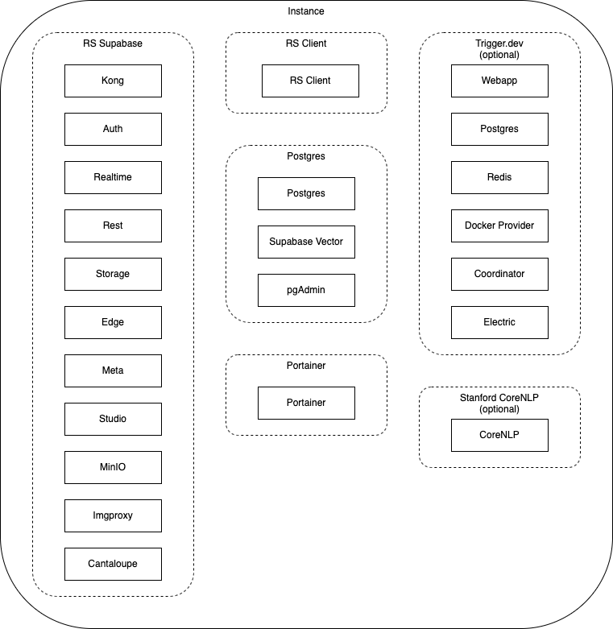
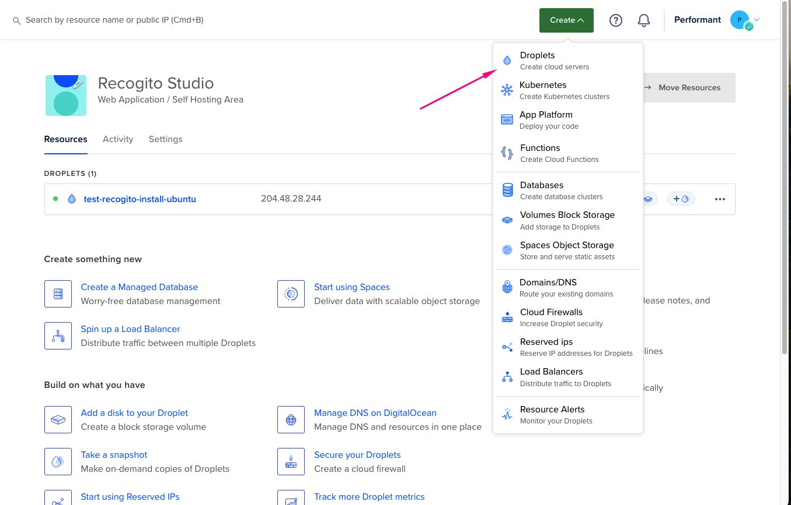
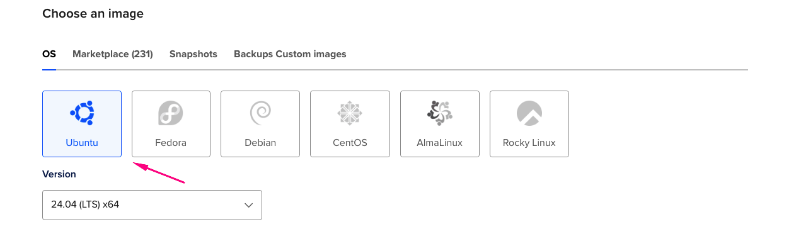
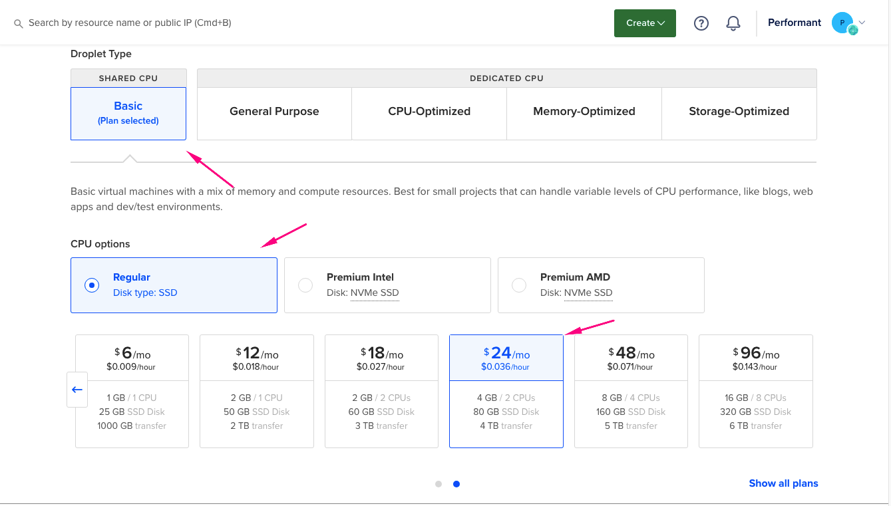
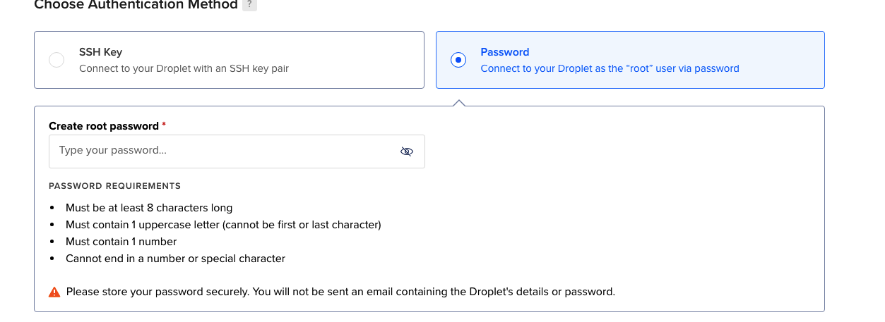
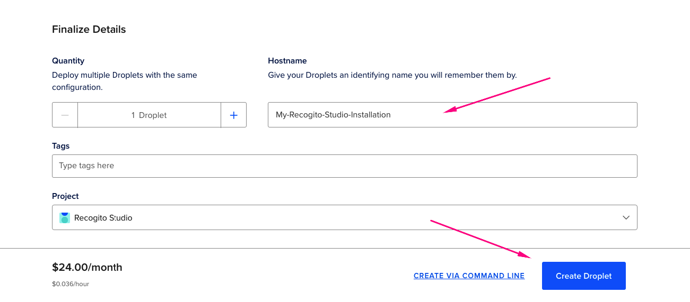
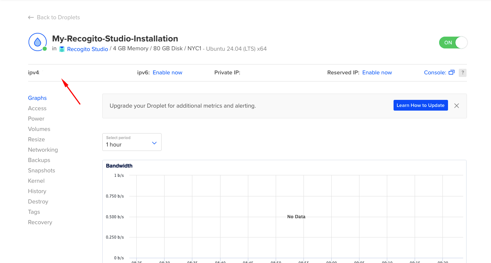
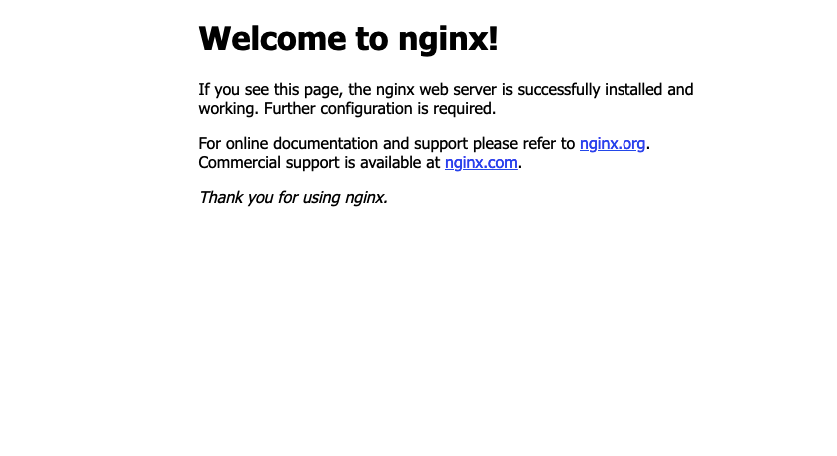
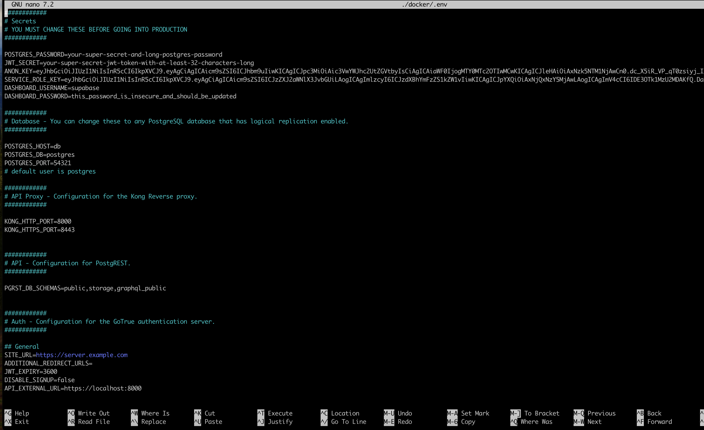
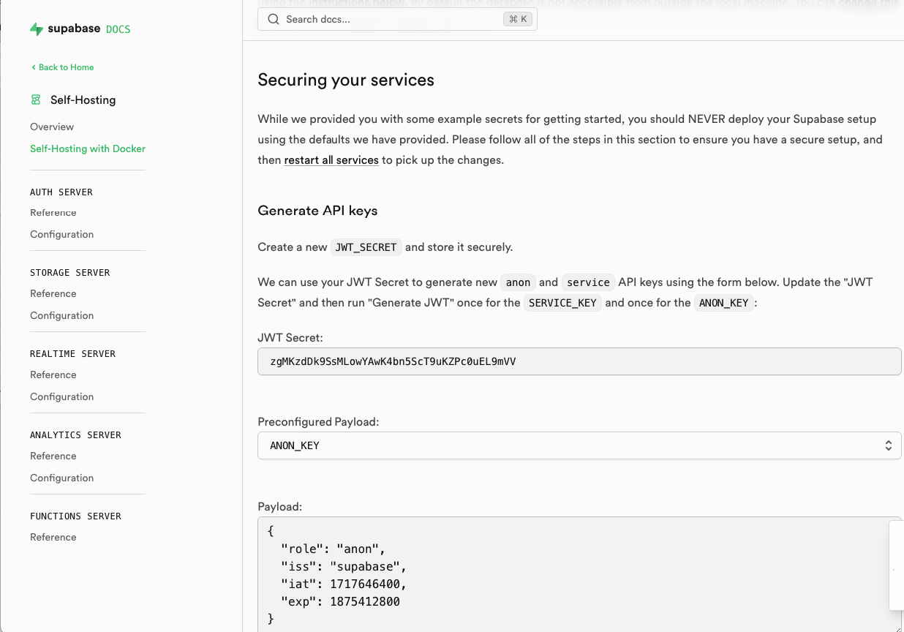

import { Card, CardGrid } from '@astrojs/starlight/components';

Recogito-Studio is ready for self-hosting and these instructions detail the steps necessary for deployment on Ubuntu Linux, v24 (although many earlier versions will also work as well). The deployment strategy utilizes [Docker](https://www.docker.com/), [Docker Compose](https://docs.docker.com/compose/), and [Nginx](https://nginx.org).

In the example below we will install Recogito Studio on a [Digital Ocean Droplet](https://docs.digitalocean.com/products/droplets/). Digital Ocean is a well-regarded cloud hosting platform known for its ease of use and competitive pricing, but the instructions are easily translated to other cloud platforms or on-premises data centers.

## System Architecture

### Components

<CardGrid>
  <Card title="RS Supabase" icon="puzzle">
    Most of the <a href="https://supabase.com/">Supabase</a> processes, plus MinIO for object storage, and Cantaloupe as a IIIF server.
  </Card>
  <Card title="RS Client" icon="laptop">
    The client application of Recogito Studio, written in <a href="https://astro.build/">Astro JS</a>.
  </Card>
  <Card title="Postgres" icon="information">
    Postgres server with Supabase Vector process and pgAdmin for database management.
  </Card>
  <Card title="Portainer" icon="setting">
    Container management tool for managing and monitoring the Docker environment.
  </Card>
</CardGrid>



#### Optional Components

- **Trigger.dev** - Background job system (required for plugin-ner)
- **Stanford CoreNLP** - Natural Language Processor (required for plugin-ner)

### Required Domains

A full setup requires five DNS records pointing to your instance's public IP:

- `https://server.example.com` - Main server
- `https://client.example.com` - Client application  
- `https://portainer.example.com` - Container management
- `https://pgadmin.example.com` - Database administration
- `https://minio.example.com` - Object storage

For optional plugin-ner:
- `https://trigger.example.com` - Trigger.dev dashboard

## System Requirements

- **Operating System**: Ubuntu Linux v24 (recommended)
- **Memory**: Minimum 4GB
- **Storage**: 50GB+ recommended
- **Network**: Public IP address with DNS access

## Installation Steps

### 1. Create and Secure Your Server

#### Create a Digital Ocean Droplet

##### 1. Start Droplet Creation

Begin by creating a new droplet in your Digital Ocean account.



##### 2. Choose Operating System

Choose Ubuntu (latest version) as your operating system and select appropriate region and datacenter.



##### 3. Configure Droplet Specifications

Choose Basic shared CPU, Regular SSD with minimum: 4GB Memory, 2 CPUs, 80GB SSD.



##### 4. Select Authentication Method

Choose your preferred authentication method and enable automatic backups (recommended for production).



##### 5. Finalize Droplet Creation

Review your settings and create the droplet.



##### 6. Droplet Created Successfully

Once created, note the IPv4 address for your new droplet.



#### Set Up Non-Root User and Firewall

Connect to your server:
```bash
ssh root@your_server_ip
```

Update the system:
```bash
apt update
```

Create a new user with sudo privileges:
```bash
adduser recogito
usermod -aG sudo recogito
```

Configure UFW firewall:
```bash
ufw app list
ufw allow OpenSSH
ufw enable
ufw status
```

### 2. Install Nginx

Install and configure the web server:

```bash
sudo apt update
sudo apt install nginx
```

Adjust firewall for web traffic:
```bash
sudo ufw allow 'Nginx Full'
sudo ufw status
```

Verify Nginx is running:
```bash
systemctl status nginx
```

Test by navigating to `http://your_server_ip` - you should see the Nginx welcome page.



### 3. Install Dependencies

#### Git
Verify Git is installed:
```bash
git --version
```

#### Docker
Install via SNAP:
```bash
sudo snap install docker
```

#### NPM
Install Node Package Manager:
```bash
sudo apt install npm
```

### 4. Clone and Configure Recogito Studio

Clone the repository:
```bash
git clone --depth 1 https://github.com/recogito/recogito-studio.git
cd ./recogito-studio
```

Copy and edit environment variables:
```bash
cp ./docker/.env.example ./docker/.env
nano ./docker/.env
```



### 5. Critical Environment Variables

Update these required values in your `.env` file:

#### Security Passwords
- **POSTGRES_PASSWORD**: Secure password (12+ characters, alphanumeric)
- **DASHBOARD_PASSWORD**: Supabase dashboard password
- **ORG_ADMIN_PW**: Initial superuser password (admin@example.com)

#### JWT Configuration
Generate JWT secret:
```bash
openssl rand -base64 36
```

Use [Supabase JWT Generator](https://supabase.com/docs/guides/self-hosting/docker#securing-your-services):



- **JWT_SECRET**: Generated secret above
- **ANON_KEY**: Generate with ANON_KEY payload
- **SERVICE_ROLE_KEY**: Generate with SERVICE_KEY payload

#### URLs and Access
- **SITE_URL**: Your server domain (`https://server.example.com`)
- **ROOM_SECRET**: Generate with `openssl rand -base64 24`
- **MINIO_ROOT_USER/PASSWORD**: MinIO dashboard credentials
- **PGADMIN_ADMIN_EMAIL/PASSWORD**: pgAdmin web access

### 6. Run Installation

Execute the installation script:
```bash
sudo bash ./install-self-hosted-docker.sh
```

Respond "Yes" to database push when prompted.

### 7. Configure Nginx Routes

Copy and customize Nginx configuration files:

#### Client Configuration
```bash
sudo cp ./nginx.client.example.com /etc/nginx/sites-available/client.example.com
sudo nano /etc/nginx/sites-available/client.example.com
```

Replace `client.example.com` with your actual client domain.

#### Server Configuration
```bash
sudo cp ./nginx.server.example.com /etc/nginx/sites-available/server.example.com
sudo nano /etc/nginx/sites-available/server.example.com
```

Update:
- `server_name` with your server URL
- `Access-Control-Allow-Origin` headers with your client URL

#### Support Services
Repeat for remaining services:
```bash
sudo cp ./nginx.minio.example.com /etc/nginx/sites-available/minio.[yourdomain].com
sudo cp ./nginx.pgadmin.example.com /etc/nginx/sites-available/pgadmin.[yourdomain].com
sudo cp ./nginx.portainer.example.com /etc/nginx/sites-available/portainer.[yourdomain].com
```

#### Update nginx.conf
Add WebSocket support to `/etc/nginx/nginx.conf`:
```bash
sudo nano /etc/nginx/nginx.conf
```

Add to http block:
```nginx
map $http_upgrade $connection_upgrade {
    default upgrade;
    '' close;
}
```

#### Enable Sites
Create symbolic links:
```bash
sudo ln -s /etc/nginx/sites-available/server.example.com /etc/nginx/sites-enabled/
sudo ln -s /etc/nginx/sites-available/client.example.com /etc/nginx/sites-enabled/
sudo ln -s /etc/nginx/sites-available/pgadmin.example.com /etc/nginx/sites-enabled/
sudo ln -s /etc/nginx/sites-available/minio.example.com /etc/nginx/sites-enabled/
sudo ln -s /etc/nginx/sites-available/portainer.example.com /etc/nginx/sites-enabled/
```

Test and restart:
```bash
sudo nginx -t
sudo systemctl restart nginx
```

### 8. SSL Certificates with Let's Encrypt

Install Certbot:
```bash
sudo snap install core; sudo snap refresh core
sudo snap install --classic certbot
sudo ln -s /snap/bin/certbot /usr/bin/certbot
```

Generate certificates for each domain:
```bash
sudo certbot --nginx -d client.example.com
sudo certbot --nginx -d server.example.com
sudo certbot --nginx -d pgadmin.example.com
sudo certbot --nginx -d minio.example.com
sudo certbot --nginx -d portainer.example.com
```

Verify auto-renewal:
```bash
sudo systemctl status snap.certbot.renew.service
sudo certbot renew --dry-run
```

## Testing Your Installation

### Test Client Access
Navigate to your client URL (`https://client.example.com`). You should see the Recogito Studio interface.

Sign in with:
- **Username**: `admin@example.com`
- **Password**: Value from `ORG_ADMIN_PW` in your `.env` file

### Test Studio Access
Navigate to your server URL (`https://server.example.com`) for Supabase studio access:
- **Username**: `supabase`
- **Password**: Value from `DASHBOARD_PASSWORD` in your `.env` file

## Additional Resources

- [Recogito Studio SDK](/guides/sdk/) - For adding plugins
- [Plugin NER](https://github.com/recogito/plugin-ner) - Named Entity Recognition plugin
- [Supabase Documentation](https://supabase.com/docs) - Platform usage details

## What's Next

Future documentation will cover:
- Configuration and UI customization
- SMTP setup for notifications
- Logging with Logflare integration
- External Postgres database configuration
- Production hardening and monitoring